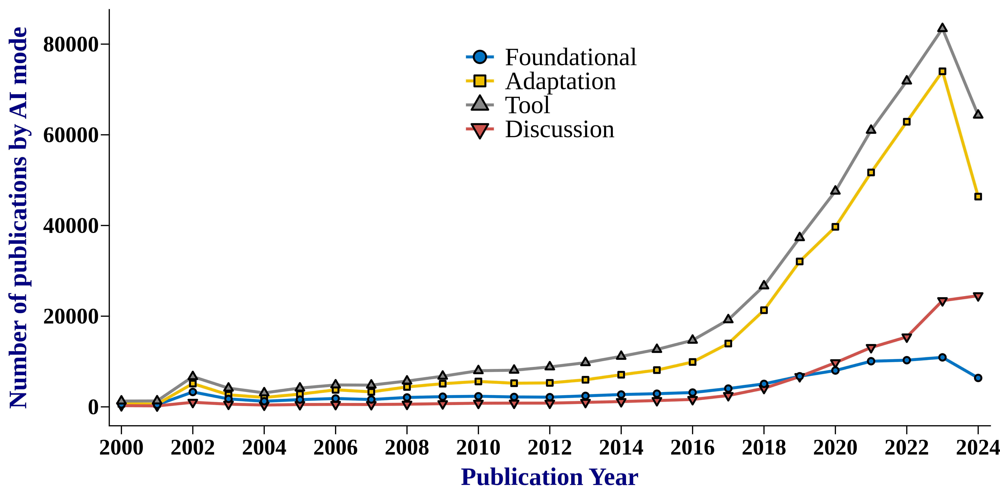
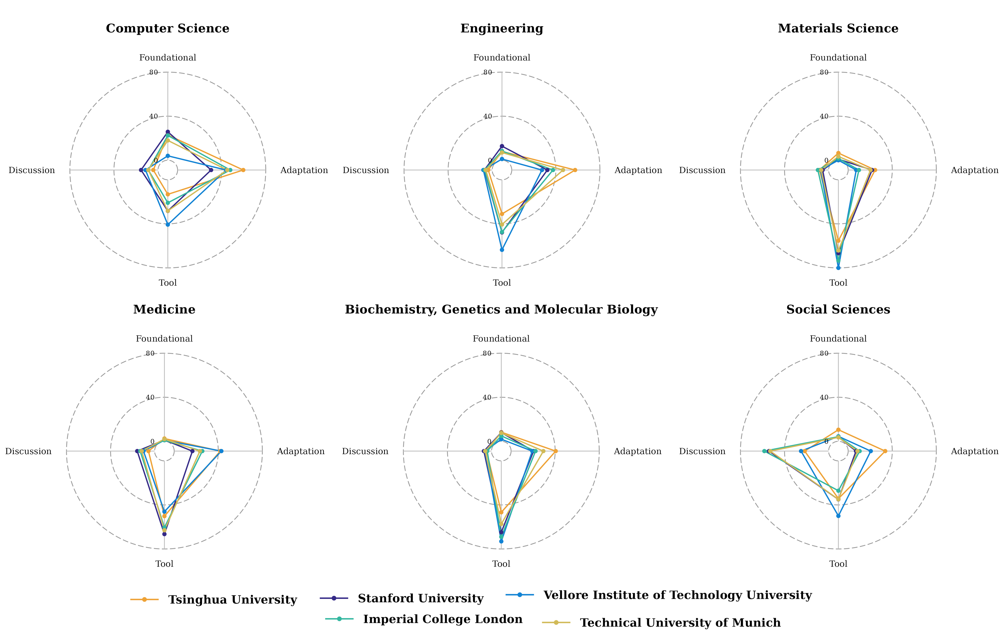

# AI mode classfication
This repo contains code and data for paper **Assessing how AI is being used in science: a public tool for policy analysis**

## GPT prompts
### Stage I: AI relevance classfication 

### Stage II: AI mode classfication 

## Environment
Python 3.11, transformers v4.37.2, openai v1.98.0

## File reporsitory
- `AI_relevance_genai_batch.py`: code for generating synthetic data for AI relevance classification using GPT
- `AI_mode_classification_genAI_batch.py`: code for generating synthetic data for AI mode classification using GPT
- `run_classification.py`: code for running the classification tasks using SciBERT
- `Scripts/run_classification_AI_relevance.sh`: script for running the AI relevance classification task
- `Scripts/run_classification_AI_mode.sh`: script for running the AI mode classification task

## Descriptive Plots
- Fig. 1. Trends in number of scientific publications by AI modes, 2000-2024, showing the slow growth of foundational AI research in science but the relatively recent rapid growth of AI adaption, tool, and discussion research in science.

- Fig. 2. Scientific publications by AI mode, classified by foundational, adaptation, tool, and discussion modes for 20 leading counties by all AI publications
  

- Fig. 3. Radar charts for six selected disciplines showing percentage of AI research publications in the top coutries by foundational, adaptation, tool, and discussion modes. The disciplines shown are computer science, engineering, materials science, medicine, biochemistry, genetics and molecular biology, and social sciences. 

- Fig. 4. Radar charts for six selected disciplines showing percentage of AI research publications in the top institutes by foundational, adaptation, tool, and discussion modes. The disciplines shown are computer science, engineering, materials science, medicine, biochemistry, genetics and molecular biology, and social sciences. 
